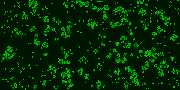
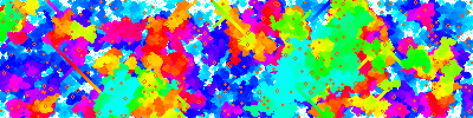

# Game of Life Web Component

A [web component](https://developer.mozilla.org/en-US/docs/Web/API/Web_components) to render [Conway's Game of Life](https://jedidiah.dev/playground/game-of-life/) in an offscreen canvas.



## Installation

You can install with `npm install @jedidiah/game-of-life-wc --save` or download the `game-of-life.js` JavaScript file manually and add it to your site’s JavaScript assets.

## Usage

Basic:

```html
<game-of-life></game-of-life>
```

Custom:

```html
<game-of-life
  cellSize="4"
  color1="rgba(255,255,255,1)"
  color1Tick="rgba(255,255,255,0.3)"
  color2="red"
  width="800"
  height="600"
>
</game-of-life>
```

See `demo.html` for more examples.

## Attributes

- `fps` - The game can run a bit too quickly, this attribute will limit the max speed to a given fps (frames per second). Note if prefers reduced motion is set on the users device then this attribute is ignored and the fps is limited to 1.<br/>_Default:_ `fps="12"`

- `cellSize` - How many pixels wide should each cell be drawn. <br/>_Default:_ `cellSize="1"`

- `color1` - This is the colour of the background and dead cells <br/>_Default:_ `color1="rgba(0, 20, 0, 1)"`

- `color1Tick` - To allow cells to fade out when they die this colour is overlayed each tick/frame of the animation. If you want dead cells to disappear straight away then set this to the same value as color1<br/>_Default:_ `color1Tick="rgba(0, 20, 0, 0.3)"`

- `color2` - This is the colour the live cells will be drawn in <br/>_Default:_ `cellSize="rgba(0, 200, 0, 1)"`

- `width` - The width of the canvas<br/>_Default:_ `width="300"`

- `height` - The height of the canvas<br/>_Default:_ `height="150"`

- `hueRotate` - Instead of setting color2 you can just have all the colours <br/>_Default:_ `hueRotate="false"`



## License
 <p xmlns:cc="http://creativecommons.org/ns#" xmlns:dct="http://purl.org/dc/terms/"><a property="dct:title" rel="cc:attributionURL" href="https://github.com/Jedidiah/game-of-life-wc">Game of Life Web Component</a> © 2025 by <a rel="cc:attributionURL dct:creator" property="cc:attributionName" href="https://jedidiah.dev/">Jedidiah Broadbent</a> is licensed under <a title="Creative Commons Attribution-ShareAlike 4.0 International" href="https://creativecommons.org/licenses/by-sa/4.0/" target="_blank" rel="license noopener noreferrer" style="display:inline-block;">CC BY-SA 4.0</a></p> 

This license requires that reusers give credit to the creator. It allows reusers to distribute, remix, adapt, and build upon the material in any medium or format, even for commercial purposes. If others remix, adapt, or build upon the material, they must license the modified material under identical terms. This includes use in training AI models as the resulting model must be released under identical terms.

## Contributing/Developing

- `npm install` to install vite and vitest
- `npm run dev` to see the demo at http://localhost:5173/demo.html
- `npm run test` to run the unit tests
- `npm run build` to build the component to `./dist`